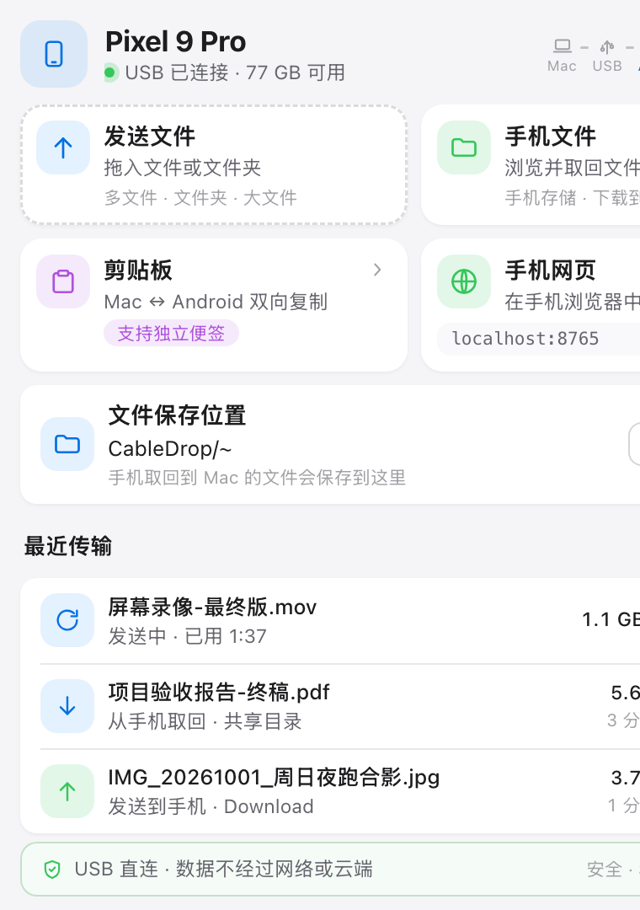
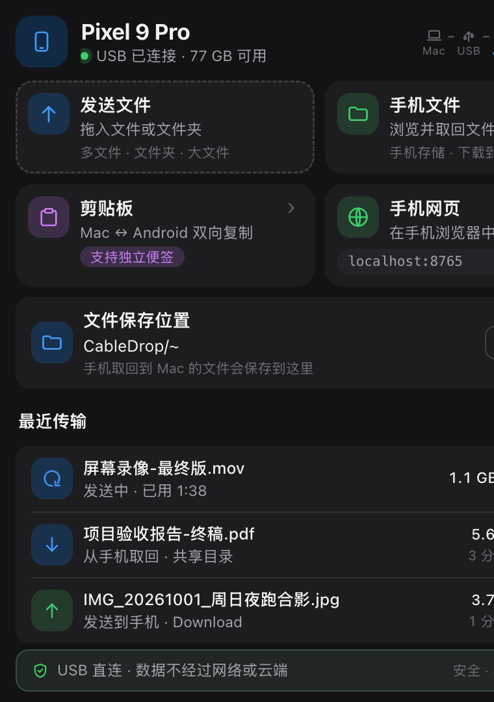
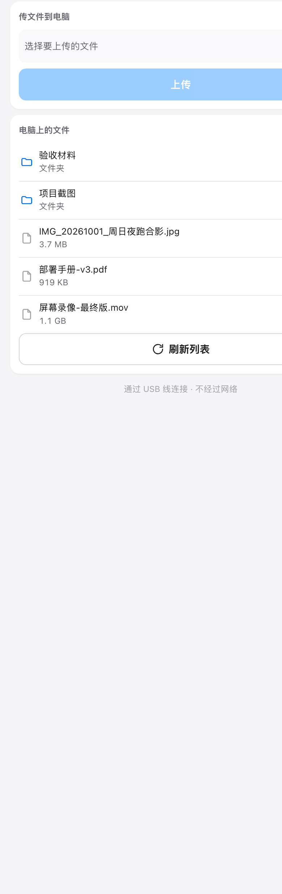

<p align="center">
  
</p>

<h1 align="center">CableDrop</h1>

<p align="center">
  Move files and text between your computer and an Android phone over <b>one USB cable</b>.<br>
  No network. No cloud. Nothing to install on the phone.
</p>

<p align="center">
  <a href="README.zh-CN.md">中文说明</a> ·
  <a href="#quick-start">Quick start</a> ·
  <a href="#screenshots">Screenshots</a> ·
  <a href="#troubleshooting">Troubleshooting</a> ·
  <a href="site/index.html">Landing page</a> ·
  <a href="CONTRIBUTING.md">Contributing</a>
</p>

---

## What it does

- **Files, both directions.** Drag onto the panel or pick files to send; browse the phone's storage and pull anything back. The shared folder on the computer is a full file browser on the phone, subfolders included.
- **Clipboard, both directions.** Copy on the computer, tap to copy on the phone. Paste text on the phone, it lands in the computer's clipboard. A separate note slot sends text without clobbering your clipboard.
- **Real progress.** Byte-weighted percentage for multi-file batches, elapsed time while adb gives no stream progress, real percentage for phone uploads.

Everything travels over the cable through `adb reverse`: the computer listens on `127.0.0.1` only, the phone reaches it at `localhost:8765`. No firewall prompt, nothing on the LAN.

## Screenshots

| | |
|---|---|
|  |  |
| **Desktop panel** — macOS menu bar, a real 380×540 window | Same panel in dark mode |

<p align="center">
  
</p>

**Phone page** — the whole page at a 390×844 phone viewport, served from the same process and opened in any mobile browser at `localhost:8765`. Dark mode is a `prefers-color-scheme` switch, not a setting.

Both pages are one design language: the same colour tokens, radii and type scale live in `internal/serve/assets/css/tokens.css`, shared by the panel and the phone page.

## Quick start

1. **Get adb** — install [Android Platform Tools](https://developer.android.com/tools/releases/platform-tools) (`brew install android-platform-tools`), or drop the `platform-tools` folder next to the binary.
2. **Build** (macOS):
   ```bash
   make app          # CableDrop.app — a menu bar app, no Dock icon
   open CableDrop.app
   ```
3. **Plug the cable** and set the phone's USB mode to **File transfer / MTP**.
4. Click the menu bar icon to open the panel. On the phone, open **http://localhost:8765** — that is the whole phone UI.

That's it. The panel shows the connection state; the phone page is the same API driving a mobile layout.

### Platform builds

```bash
make build     # native binary for this machine
make app       # macOS .app (menu bar, LSUIElement)
make windows   # Windows exe, cross-compiles from macOS (no cgo)
make linux     # Linux binary (needs GTK3 + WebKitGTK 4.1)
make apk       # Android APK (optional, needs Android SDK + JDK 17+)
```

### The APK (optional)

The phone page works in any browser. The APK is a ~845 KB WebView shell around
the same page for when you want it to feel like an app. It has no dependencies
beyond the platform WebView, and it adds what a browser page can't do:

- real file picking for uploads, and downloads routed into the system Downloads app with correct non-ASCII filenames
- a clear reconnect screen when the cable is out
- a themed window and status bar that follow the system light/dark setting, so the page no longer flashes white on a dark phone

It bundles no server — plug the cable in, same as the browser.

```bash
make apk        # → dist/CableDrop.apk   (minSdk 24, targetSdk 36)
```

## How it works

```
   Phone                      USB cable                     Computer
┌──────────┐                                             ┌───────────────┐
│ browser  │ ←── adb reverse tcp:8765 ────────────────── │ 127.0.0.1:8765│
└──────────┘                                             │  Go HTTP      │
                                                         └──────┬────────┘
                                          the same JSON API feeds │
                                                         ┌──────┴────────┐
                                                         │  native panel │
                                                         └───────────────┘
```

- One Go binary; the frontend is plain HTML/CSS/JS embedded with `go:embed` — no npm, no build step.
- The clipboard goes through the page rather than `adb shell`: Android 10+ forbids writing the device clipboard over adb, and `localhost` is a secure context, so the browser Clipboard API works there.
- Device presence is tracked over a persistent `adb track-devices` connection — no process forking while idle.
- Icons are drawn in code by a small in-process rasteriser; there is no binary artwork in the repository.

## Building a release

```bash
make dmg            # universal macOS .app (amd64 + arm64) and a .dmg
make windows        # both Windows architectures, cross-compiled from macOS
make linux          # native Linux binary — needs GTK 3 and WebKitGTK 4.1
make apk            # dist/CableDrop.apk
```

`.github/workflows/release.yml` runs exactly these on a `v*` tag, smoke-tests
each artifact (architecture of every slice, the PE headers, the APK's manifest
and icon densities) and attaches them to a GitHub Release with a checksum file.
Running that workflow by hand builds everything and publishes nothing.

`site.yml` publishes [`site/`](site/) to GitHub Pages, staging it with the
screenshots it references — see [site/README.md](site/README.md) for why the
staging step exists.

## Landing page

[`site/index.html`](site/index.html) is a dependency-free product page for
CableDrop — open it directly, or serve the folder as static files (GitHub Pages
works as-is). See [`site/README.md`](site/README.md).

## Where adb is found

`CABLEDROP_ADB` environment variable → next to the executable →
`platform-tools/` next to the executable → Android Studio's SDK location →
`PATH`.

## Troubleshooting

| Symptom | Fix |
|---|---|
| "找不到 adb" in the panel | Install Platform Tools, then click 重新检测手机. The exact paths searched are listed above. |
| Panel says 未连接手机 | Plug the cable, then set the phone's USB mode to **File transfer (MTP)**. "仅充电" mode is invisible to adb. |
| Phone page doesn't open | The panel must show 已连接. If it says the tunnel failed, unplug and replug the cable; the tunnel is re-established on every reconnect. |
| Phone shows the panel layout | You opened `/panel` — that's the desktop page. Use `/`. |
| Port 8765 is taken by something else | CableDrop falls back to another port automatically; the panel shows the actual URL. |
| Uploads/files missing on the phone | Pull destinations are always the shared folder on the computer (~/CableDrop by default). Pushes land in the phone's Download folder. |

## Project layout

```
main.go             flag dispatch and assembly
internal/model      shared data types
internal/device     adb wrapper, device file ops, path whitelist
internal/clipboard  desktop clipboard via platform commands
internal/picker     system file dialogs as subprocesses
internal/serve      HTTP API + embedded assets
internal/app        state machine (implements serve.Backend)
internal/icon       code-drawn icons and rasteriser
internal/ui         the only package that talks to Wails
android/            optional APK shell (platform APIs only)
site/               static product landing page
scripts/shots.py    regenerates docs/*.png
```

### Regenerating the screenshots

`docs/*.png` is generated, not hand-captured. Both pages are `100dvh` roots
wrapping an inner scroller, so a plain `--screenshot` only ever captures the
viewport — the rest of the page is scrolled out and unreachable. The script
releases those scrollers at capture time and then shoots past the viewport, so
each image is the whole page at a viewport the layout was actually designed for
(the panel's real 380×540 window; a 390×844 phone).

Every page is shot in both languages. The script forces the locale through the
DevTools override rather than letting the host machine decide, so a run on a
Chinese Mac and a run on an English one produce the same files — the host
machine's locale used to leak straight into the English README. English keeps
the plain names (`docs/panel-light.png`); the other languages sit in a
subdirectory (`docs/zh/panel-light.png`). `apk-light.png` is the one exception:
it is a real device capture (`adb shell screencap`, status bar cropped, scaled
to 780 wide), taken by hand against the demo fixture rather than the live
server, so it does not list anyone's real files.

```bash
CABLEDROP_SHOTS=1 go test -run TestScreenshotServer -timeout 1h ./internal/serve/ &
python3 scripts/shots.py          # needs Chrome; writes docs/{panel,phone}-{light,dark}.png
                                  # and docs/zh/{panel,phone}-{light,dark}.png
```

The landing page swaps its screenshots with the language, and
`internal/serve/site_test.go` holds that together: every `shot.*.src` key needs
a counterpart in the other language pointing at a file that exists, and each
``'s declared box has to match the real image's aspect ratio.

## Status & compatibility

- macOS 12+ (universal), Windows 10+ (amd64/arm64), Linux with GTK3 + WebKitGTK 4.1, Android 7.0+ (APK, minSdk 24).
- Tested against `adb` from current Platform Tools; very old adb falls back to polling.

## Contributing

PRs welcome — read [CONTRIBUTING.md](CONTRIBUTING.md) first; a few rules there
are hard constraints that exist because of genuinely painful bugs.

## License

[MIT](LICENSE)
