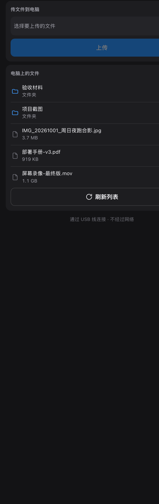

<p align="center">
  
</p>

<h1 align="center">CableDrop</h1>

<p align="center">
  Move files and text between your computer and an Android phone over <b>one USB cable</b>.<br>
  No network. No cloud. Nothing to install on the phone.
</p>

<p align="center">
  <a href="README.zh-CN.md">中文说明</a> ·
  <a href="#quick-start">Quick start</a> ·
  <a href="#troubleshooting">Troubleshooting</a> ·
  <a href="CONTRIBUTING.md">Contributing</a>
</p>

---

## What it does

| | |
|---|---|
|  |  |
| **Desktop panel** — macOS menu bar, 380×540 | **Phone page** — full page, opens in any mobile browser |

- **Files, both directions.** Drag onto the panel or pick files to send; browse the phone's storage and pull anything back. The shared folder on the computer is a full file browser on the phone, subfolders included.
- **Clipboard, both directions.** Copy on the computer, tap to copy on the phone. Paste text on the phone, it lands in the computer's clipboard. A separate note slot sends text without clobbering your clipboard.
- **Real progress.** Byte-weighted percentage for multi-file batches, elapsed time while adb gives no stream progress, real percentage for phone uploads.

Everything travels over the cable through `adb reverse`: the computer listens on `127.0.0.1` only, the phone reaches it at `localhost:8765`. No firewall prompt, nothing on the LAN.

## Quick start

1. **Get adb** — install [Android Platform Tools](https://developer.android.com/tools/releases/platform-tools) (`brew install android-platform-tools`), or drop the `platform-tools` folder next to the binary.
2. **Build** (macOS):
   ```bash
   make app          # CableDrop.app — a menu bar app, no Dock icon
   open CableDrop.app
   ```
3. **Plug the cable** and set the phone's USB mode to **File transfer / MTP**.
4. On the phone, open **http://localhost:8765** — that is the whole phone UI.

That's it. The panel shows the connection state; the phone page is the same API driving a mobile layout.

### Platform builds

```bash
make build     # native binary for this machine
make app       # macOS .app (menu bar, LSUIElement)
make windows   # Windows exe, cross-compiles from macOS (no cgo)
make linux     # Linux binary (needs GTK3 + WebKitGTK 4.1)
make apk       # Android APK (optional, needs Android SDK + JDK 17+)
```

### The APK (optional)

The phone page works in any browser. The APK is a 860 KB WebView shell for
the same page that adds what a browser page can't do: real file picking for
uploads, downloads routed into the system Downloads app with correct
non-ASCII filenames, and a clear reconnect screen when the cable is out. It
bundles no server — plug the cable in, same as the browser.

```bash
make apk        # → dist/CableDrop.apk
```

## How it works

```
   Phone                      USB cable                     Computer
┌──────────┐                                             ┌───────────────┐
│ browser  │ ←── adb reverse tcp:8765 ────────────────── │ 127.0.0.1:8765│
└──────────┘                                             │  Go HTTP      │
                                                         └──────┬────────┘
                                          the same JSON API feeds │
                                                         ┌──────┴────────┐
                                                         │  native panel │
                                                         └───────────────┘
```

- One Go binary; the frontend is plain HTML/CSS/JS embedded with `go:embed` — no npm, no build step.
- The clipboard goes through the page rather than `adb shell`: Android 10+ forbids writing the device clipboard over adb, and `localhost` is a secure context, so the browser Clipboard API works there.
- Device presence is tracked over a persistent `adb track-devices` connection — no process forking while idle.
- Icons are drawn in code by a small in-process rasteriser; there is no binary artwork in the repository.

## Where adb is found

`CABLEDROP_ADB` environment variable → next to the executable →
`platform-tools/` next to the executable → Android Studio's SDK location →
`PATH`.

## Troubleshooting

| Symptom | Fix |
|---|---|
| "找不到 adb" in the panel | Install Platform Tools, then click 重新检测手机. The exact paths searched are listed above. |
| Panel says 未连接手机 | Plug the cable, then set the phone's USB mode to **File transfer (MTP)**. "仅充电" mode is invisible to adb. |
| Phone page doesn't open | The panel must show 已连接. If it says the tunnel failed, unplug and replug the cable; the tunnel is re-established on every reconnect. |
| Phone shows the panel layout | You opened `/panel` — that's the desktop page. Use `/`. |
| Port 8765 is taken by something else | CableDrop falls back to another port automatically; the panel shows the actual URL. |
| Uploads/files missing on the phone | Pull destinations are always the shared folder on the computer (~/CableDrop by default). Pushes land in the phone's Download folder. |

## Project layout

```
main.go             flag dispatch and assembly
internal/model      shared data types
internal/device     adb wrapper, device file ops, path whitelist
internal/clipboard  desktop clipboard via platform commands
internal/picker     system file dialogs as subprocesses
internal/serve      HTTP API + embedded assets
internal/app        state machine (implements serve.Backend)
internal/icon       code-drawn icons and rasteriser
internal/ui         the only package that talks to Wails
android/            optional APK shell (platform APIs only)
```

## Status & compatibility

- macOS 12+ (universal), Windows 10+ (amd64/arm64), Linux with GTK3 + WebKitGTK 4.1, Android 7.0+ (APK).
- Tested against `adb` from current Platform Tools; very old adb falls back to polling.

## Contributing

PRs welcome — read [CONTRIBUTING.md](CONTRIBUTING.md) first; a few rules there
are hard constraints that exist because of genuinely painful bugs.

## License

[MIT](LICENSE)
